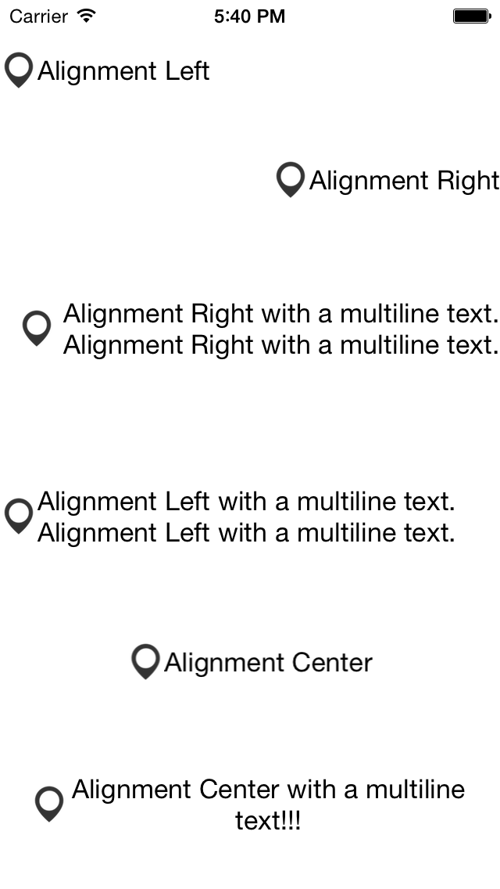

JTImageLabel
============


JTImageLabel is a simple view which contain a `UILabel` and a `UIImageView` which stay side by side, even if you change the alignment of the `UILabel`.

## Installation

With [CocoaPods](http://cocoapods.org/), add this line to your Podfile.

    pod 'JTImageLabel', '~> 1.0.0'

## Screenshots




## Usage

It's very easy to use.

```objective-c
#import <UIKit/UIKit.h>

#import "JTImageLabel.h"

@interface ViewController : UIViewController

@property (weak, nonatomic) IBOutlet JTImageLabel *label;

@end
```

You can access directly to the `imageView` and the `textLabel`.
Also you can define the space between the two views.

```objective-c
@implementation ViewController

- (void)viewDidLoad
{
    [super viewDidLoad];

    self.label.imageView.image = [UIImage imageNamed:@"icon"];
    self.label.textLabel.text = @"Test";
    self.label.textLabel.textAlignment = NSTextAlignmentRight;
    self.label1.space = 10.; // Add a space between the imageView and the textLabel
}
```

You cannot change the `frame` of the `imageView` and the `textLabel`. The `imageView` has the same size as this image and the `textLabel` adapts to its relative content.


## Requirements

- iOS 7 or higher
- Automatic Reference Counting (ARC)

## License

JTImageLabel is released under the MIT license. See the LICENSE file for more info.
